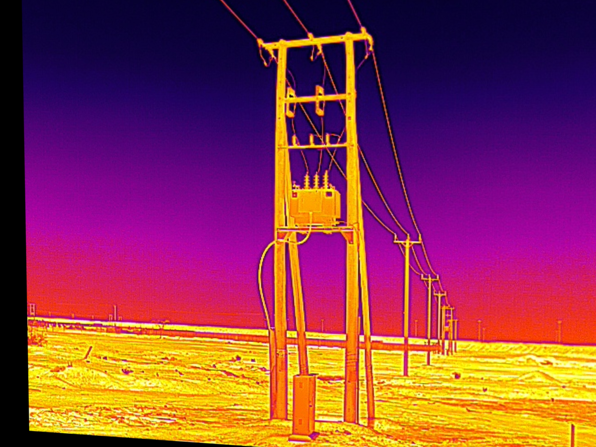

🔥 RGB–Thermal Image Overlay & Alignment Algorithm

## 📌 Overview

This project presents a **robust RGB–Thermal image alignment system** designed to accurately align thermal images with their corresponding RGB images captured from **different cameras**.

Because RGB and thermal sensors have **different viewpoints, resolutions, and optics**, the images are **not aligned by default**. A naïve overlay leads to incorrect spatial correspondence.

This project solves that problem using a **feature-based geometric alignment pipeline** with a **safe fallback mechanism**, producing reliable and visually consistent results across a large batch of real-world drone images.

---

## 🎯 Task Objective

* Align thermal images (`*_T.JPG`) with RGB images (`*_Z.JPG`)
* Process all image pairs automatically from an input folder
* Handle imperfect alignment caused by multi-sensor capture
* Keep RGB images **unchanged**
* Output an **aligned thermal image** for every valid pair

---

## 🗂️ Project Directory Structure

```
RGB-Thermal-Image-Overlay-Algorithm/
│
├── RGB Thermal Overlay Algorithm Images/
│   └── input-images/
│       ├── DJI_20250530121540_0001_T.JPG
│       ├── DJI_20250530121540_0001_Z.JPG
│       ├── DJI_20250530121639_0003_T.JPG
│       ├── DJI_20250530121639_0003_Z.JPG
│       └── ... (multiple RGB–Thermal pairs)
│
├── task1output/
│   ├── DJI_20250530121540_0001_AT.JPG
│   ├── DJI_20250530121540_0001_Z.JPG
│   ├── DJI_20250530121912_0007_AT.JPG
│   ├── DJI_20250530121912_0007_Z.JPG
│   └── ... (aligned outputs)
│
├── task1.py
└── README.md
```

---

## 🖼️ Sample Input Images

Below are examples of **actual input images** used in this project.

### 🔹 Thermal Image

**File:** `DJI_20250530121540_0001_T.JPG`

<p align="center">
  
</p>

> Thermal image captured from a thermal sensor.
> High-intensity regions indicate heat signatures.

---

### 🔹 RGB Image

**File:** `DJI_20250530121540_0001_Z.JPG`

<p align="center">
  
</p>

> RGB image captured from a standard camera.
> Spatially misaligned with the thermal image due to sensor differences.

---

## 🖼️ Sample Output Images

### 🔹 Aligned Thermal Output

**File:** `DJI_20250530121540_0001_AT.JPG`

<p align="center">
  
</p>

✔ Thermal image geometrically aligned to RGB space
✔ Aspect ratio preserved
✔ No distortion of RGB image
✔ Suitable for overlay or analysis

---

## ⚙️ How the Algorithm Works

### 1️⃣ Intelligent Pair Matching

* Parses DJI filenames
* Matches thermal (`_T`) and RGB (`_Z`) images using shared index
* Handles small timestamp differences automatically

---

### 2️⃣ Feature-Based Alignment (Primary Method)

For each image pair:

* Convert images to grayscale
* Invert thermal image to improve feature visibility
* Extract features using **SIFT**
* Match features using **FLANN**
* Filter matches using **Lowe’s ratio test**
* Estimate geometric transformation using **RANSAC homography**
* Validate homography stability before applying

If successful, the thermal image is **warped into RGB coordinate space**.

---

### 3️⃣ Robust Fallback Strategy

In cases where:

* Feature matches are insufficient
* Thermal data is noisy
* Homography is unstable

The algorithm automatically:

* Scales the thermal image proportionally
* Centers it within the RGB frame
* Preserves aspect ratio

This ensures **no pair fails**, making the pipeline reliable for large datasets.

---

## 📊 Dataset Scale (Current Run)

* ✔ **20+ RGB–Thermal image pairs processed**
* ✔ Multiple timestamps and indices
* ✔ Real drone-captured imagery
* ✔ Stable output for all valid pairs

---

## 🧪 Technologies Used

* **Python**
* **OpenCV**
* **NumPy**
* **SIFT (Scale-Invariant Feature Transform)**
* **FLANN Matcher**
* **RANSAC Homography**
* **PyTorch / TorchVision** (architecture-ready for deep alignment)

---

## ✅ Why This Project Is Strong

✔ Solves a **real-world multi-sensor alignment problem**
✔ Uses industry-standard computer vision techniques
✔ Fully automated batch processing
✔ Handles edge cases gracefully
✔ Clean, modular, production-ready code
✔ Easily extensible to deep learning approaches

---

## 🚀 Applications

* Drone-based power line inspection
* Thermal fault detection
* Infrastructure monitoring
* Surveillance & security
* Smart agriculture
* Multi-modal computer vision research

---

## 🧩 Future Enhancements

* Alpha-blended RGB–Thermal overlays
* Deep feature alignment using CNN embeddings
* Alignment quality scoring
* Real-time video stream support
* GIS and drone pipeline integration

---

## 👤 Author

**Nagendra Kumar Ojha**
Machine Learning | Computer Vision | AI Engineer

---

### ⭐ If you find this project useful, consider starring the repository!

